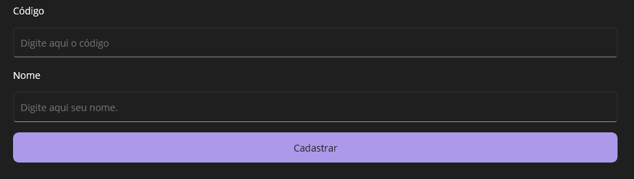

# Aplicação Crud

> Aplicação desenvolvida utilizando C#, uma linguagem frequentemente utilizada no mercado de trabalho, através do .NET MAUI onde ocorre integração do código fonte com sistemas operacionais do Windows, MAC, Android e IOS.

O foco do projeto é desenvolver um aplicativo que desenvolva as funcionalidades CRUD (Create, Retrieve, Update, Delete), mostrando conhecimento prévio com manipulação de dados utilizando SQLite integrado ao .NET Maui usando um VerticalStackLayout simples para demonstração da manipulação.

## Meta

Gabriel C. Martins – gacmartins@gmail.com

[Meu perfil do Github](https://github.com/Gabriel-Dev-C/)

## Contributing

1. Fork it (<https://github.com/Gabriel-Dev-C/Crud-Application/fork>)
2. Create your feature branch (`git checkout -b feature/fooBar`)
3. Commit your changes (`git commit -am 'Add some fooBar'`)
4. Push to the branch (`git push origin feature/fooBar`)
5. Create a new Pull Request
